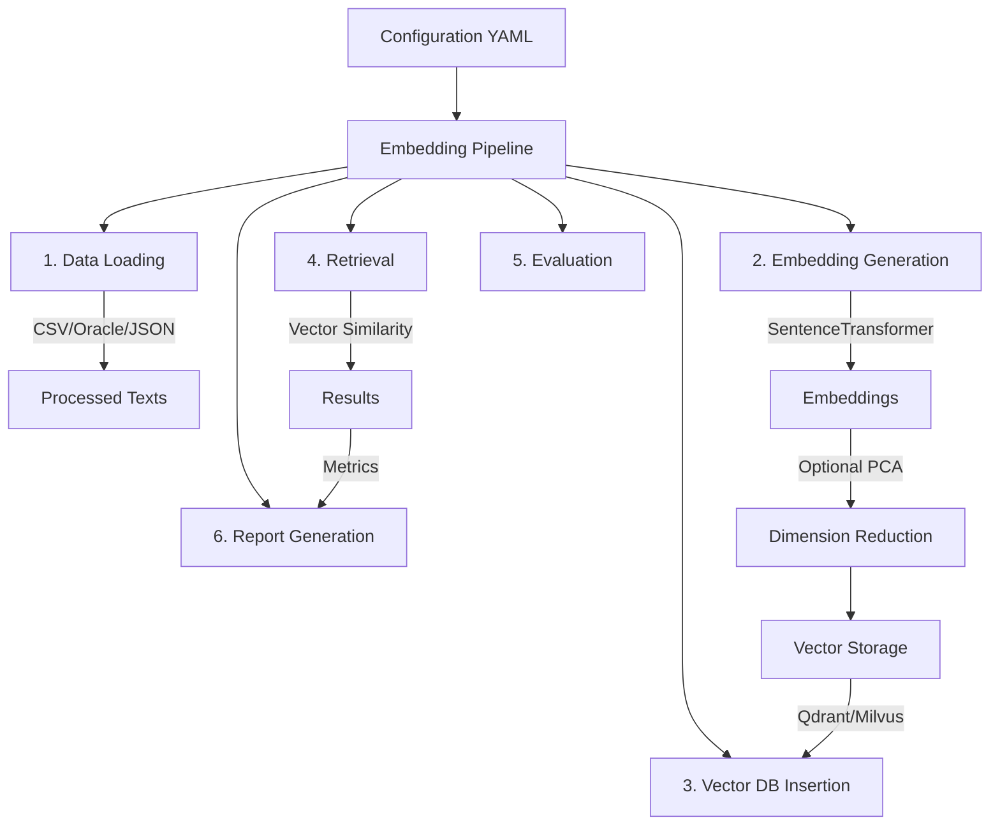

# Embedding Model Evaluation

A comprehensive framework for evaluating and comparing embedding models, featuring parallel processing, multiple chunking strategies, and vector database integration (Qdrant/Milvus). The framework supports side-by-side model comparison with detailed performance metrics and visualization.

## Architecture Overview



## Key Features

- **Multi-Model Evaluation**:
  - Side-by-side comparison of multiple embedding models
  - Comprehensive performance metrics and quality assessment
  - Automatic dimension validation and PCA reduction
  - Configurable batch size and parallelism
  - Interactive comparative reporting

- **Vector Databases**:
  - Qdrant support with HNSW indexing
  - Milvus support (standalone mode)
  - Configurable collection settings

- **Data Processing**:
  - Multiple data source types (CSV, Oracle, JSON)
  - Configurable chunking strategies
  - Parallel processing support

- **Retrieval & Evaluation**:
  - Semantic search with payload filtering
  - Configurable evaluation metrics
  - Detailed performance reporting

## Project Structure

```
embed_model_eval/
├── config/
│   ├── config_loader.py     # Configuration loading utilities
│   └── config.yaml          # Main configuration file
├── data_sources/
│   ├── loader.py           # Data source loaders
│   └── split_csv_by_size.py # CSV splitting utility
├── embeddings/
│   └── generator.py        # Embedding generation with PCA support
├── vector_databases/
│   └── insertion.py        # Vector DB insertion logic
├── retrieval/
│   └── retriever.py        # Search and retrieval logic
├── evaluation/
│   └── metrics.py          # Evaluation metrics calculation
├── reporting/
│   └── report.py           # HTML report generation
├── main.py                 # Main pipeline orchestration
└── connect_milvus_lite.py  # Vector DB connection utilities
```

## Configuration

### Model Configuration
```yaml
embed_config:
  models:                        # List of models to evaluate
    - "all-mpnet-base-v2"
    - "all-MiniLM-L6-v2"
  default_model: "all-mpnet-base-v2"  # Default if no models specified
  dimension: 384                  # Target dimension
  batch_size: 256                # Batch size for embedding
  use_pca: true                  # Enable PCA reduction
  normalize: true                # Normalize vectors
  parallelism: 4                 # Number of parallel processes
  pca_config:                    # PCA settings
    random_state: 42
    whiten: false
```

### Vector Database Configuration
```yaml
vector_db:
  type: qdrant                   # 'qdrant' or 'milvus'
  host: localhost
  port: 6333
  collection: embeddings
  batch_size: 300               # Insertion batch size
  vector_index:
    type: hnsw                  # Index type
    params:
      m: 16
      ef_construct: 100
```

## Data Flow

1. **Data Loading**:
   ```mermaid
   graph LR
       Config --> DataSource[Data Source]
       DataSource --> TextExtraction[Text Extraction]
       TextExtraction --> Chunking[Optional Chunking]
       Chunking --> ProcessedData[Processed Texts]
   ```

2. **Embedding Generation**:
   ```mermaid
   graph LR
       Texts --> Model[SentenceTransformer]
       Model --> RawEmbeddings[Raw Embeddings]
       RawEmbeddings --> |If needed| PCA[PCA Reduction]
       PCA --> FinalEmbeddings[Final Embeddings]
   ```

3. **Vector Database Flow**:
   ```mermaid
   graph LR
       Embeddings --> VectorDB[Vector DB]
       Metadata --> PayloadIndex[Payload Indexing]
       PayloadIndex --> VectorDB
       VectorDB --> Search[Vector Search]
   ```

## Usage

1. **Setup Configuration**:
   - Modify `config.yaml` with desired settings
   - Configure model, database, and evaluation parameters

2. **Run Pipeline**:
   ```bash
   python main.py --config config.yaml
   ```

3. **View Results**:
   - Check generated HTML report
   - Review console logs for detailed progress

## Implementation Details

### Embedding Generation
- Validates model dimensions against config
- Supports automatic PCA reduction
- Handles normalization and batch processing

### Vector Database Integration
- Supports both Qdrant and Milvus
- Configurable indexing and payload storage
- Efficient batch insertion

### Retrieval System
- Vector similarity search
- Payload-based filtering
- Configurable top-k results

### Report Generation
- Interactive HTML reports with model name and dimensions
- Performance metrics
- Timing and resource usage statistics

## Dependencies

- sentence-transformers
- qdrant-client
- pymilvus
- numpy
- pandas
- scikit-learn

## Error Handling

The framework includes robust error handling for:
- Model dimension mismatches
- Database connection issues
- Configuration validation
- Data processing errors

## Performance Considerations

- Batch processing for efficient embedding generation
- Configurable parallelism settings
- Optimized vector database operations
- Memory-efficient data handling

## Best Practices

1. **Configuration**:
   - Always specify model dimensions explicitly
   - Enable PCA only when necessary
   - Configure batch sizes based on available memory

2. **Data Processing**:
   - Use appropriate chunking strategies
   - Monitor memory usage for large datasets
   - Validate data quality before processing

3. **Vector Database**:
   - Configure indexes appropriately
   - Use payload filtering effectively
   - Monitor database performance

## Troubleshooting

Common issues and solutions:
1. Dimension Mismatch:
   ```
   ValueError: Model dimension mismatch: Model outputs 768-d vectors but config requires 384-d
   Solution: Enable PCA or adjust target dimension
   ```

2. Memory Issues:
   ```
   Reduce batch size in config.yaml
   Enable efficient chunking strategies
   ```

3. Database Connection:
   ```
   Verify database host/port settings
   Check collection configuration
   ```

## Features
- **Modular codebase**: Organized into data sources, embedding models, vector databases, retrieval, evaluation, reporting, config, and utilities.
- **Configurable pipeline**: All parameters (chunking, parallelism, indexing, batch size, etc.) are set via `config/config.yaml`.
- **Data sources**: Supports CSV, Oracle, JSON, TXT, and more. Selective column embedding or full file embedding.
- **Chunking strategies**: None, sentence, sliding window, fixed length.
- **Embedding models**: Semantic, dense, sparse, hybrid. Model and dimension are configurable.
- **Vector DBs**: Milvus (local/Docker), Qdrant (local server). Batch size and upsert retry logic are configurable.
- **Semantic search**: Qdrant retrieval supports semantic queries from config.
- **Evaluation metrics**: Accuracy, recall, precision, F1.
- **Progress bars**: For embedding and DB ingestion using `tqdm`.
- **Logging**: All steps use Python logging for robust error handling and progress.
- **Reporting**: Generates a detailed HTML report (`embedding_report.html`) with model, config, resource usage, timings, and metrics for easy comparison.
- **.gitignore**: Excludes cache, virtual env, data, and report files.

## Usage
### CLI (Backend)
The CLI pipeline is fully runnable:
```bash
python main.py --config config/config.yaml
```
- All configuration is loaded from `config/config.yaml`.
- Embedding, ingestion, retrieval, and evaluation are performed end-to-end.
- HTML report is generated at the end.

### Streamlit UI (Frontend)
- The Streamlit UI (`app.py`) is **in progress** and not yet feature-complete.
- Backend logic is stable and can be used for all evaluations.

## Configuration
See `config/config.yaml` for all options:
- Data source type, file, and columns
- Embedding model, batch size, dimension, parallelism
- Chunking strategy and parameters
- Vector DB type, host, port, collection, batch size, upsert retries
- Retrieval parameters, including semantic query
- Evaluation metrics and ground truth

## Current Status
The framework is production-ready with the following features:
- **Stable Backend CLI**: Full pipeline support for multi-model evaluation
- **Comparative Reporting**: Side-by-side model evaluation with detailed metrics
- **Latest Features**:
  - Multi-model evaluation and comparison
  - Enhanced HTML reporting with comparative metrics
  - Semantic search for Qdrant with configurable queries
  - Upsert retry logic and batch size optimization
  - Selective column embedding
  - Resource utilization tracking
  - Model quality assessment
- **Coming Soon**: Streamlit UI for interactive model comparison
- See `.gitignore` for excluded files and folders.

## How to Contribute
- Clone the repo and run the CLI pipeline.
- Open issues or PRs for new features, bug fixes, or UI improvements.

## License
MIT
