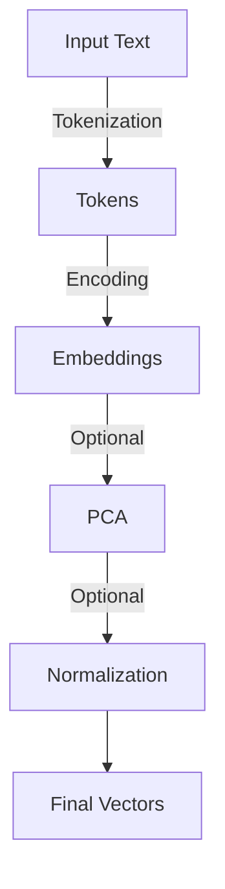
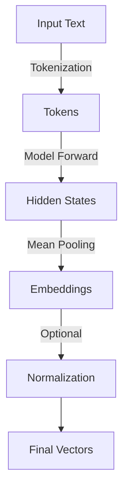
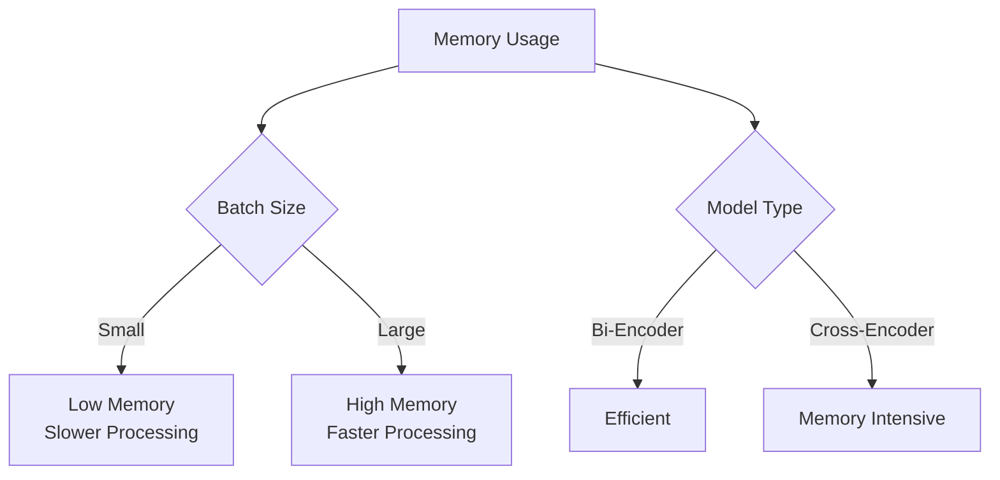

# Model Handling Guide

This document explains how the framework handles different types of embedding models and their specific configurations.

## 📊 Supported Model Types

### 1. Bi-Encoder Models (SentenceTransformers)



#### Features
- Direct embedding generation
- Semantic search support
- Dimension reduction options
- Configurable batch processing

#### Example Configuration
```yaml
embed_config:
  model: "all-MiniLM-L6-v2"
  dimension: 384
  normalize: true
  use_pca: false
```

### 2. Cross-Encoder Models



#### Features
- Hidden state extraction
- Reranking capabilities
- No direct semantic search
- Special handling required

#### Example Configuration
```yaml
embed_config:
  model: "cross-encoder/ms-marco-MiniLM-L-6-v2"
  normalize: true
  batch_size: 32
```

## 🔄 Processing Pipeline

### Bi-Encoder Processing

1. **Model Loading**
   ```python
   model = SentenceTransformer(model_name)
   ```

2. **Embedding Generation**
   ```python
   embeddings = model.encode(
       texts,
       batch_size=32,
       normalize_embeddings=True
   )
   ```

3. **Optional PCA**
   ```python
   if use_pca:
       pca.fit_transform(embeddings)
   ```

### Cross-Encoder Processing

1. **Model Loading**
   ```python
   model = CrossEncoder(model_name)
   ```

2. **Hidden State Extraction**
   ```python
   # Get hidden states from last layer
   outputs = model.model(**inputs)
   hidden_states = outputs.hidden_states[-1]
   ```

3. **Mean Pooling**
   ```python
   # Apply attention mask and pool
   masked_embeddings = hidden_states * mask
   embeddings = torch.mean(masked_embeddings, dim=1)
   ```

## 🎯 Use Cases

### Semantic Search


1. **Direct Search (Bi-Encoders)**
   - Fast vector similarity search
   - Suitable for large-scale retrieval
   - Configurable similarity metrics

2. **Reranking (Cross-Encoders)**
   - High accuracy scoring
   - Computationally intensive
   - Best for small result sets

## ⚙️ Configuration Best Practices

### 1. Model Selection

- **For Search:**
  ```yaml
  model: "all-MiniLM-L6-v2"
  dimension: 384
  normalize: true
  ```

- **For Reranking:**
  ```yaml
  model: "cross-encoder/ms-marco-MiniLM-L-6-v2"
  batch_size: 32
  ```

### 2. Batch Processing

- **Memory-Efficient:**
  ```yaml
  batch_size: 32
  parallelism: 2
  ```

- **Performance-Focused:**
  ```yaml
  batch_size: 128
  parallelism: 4
  ```

### 3. Dimension Reduction

- **With PCA:**
  ```yaml
  use_pca: true
  pca_config:
    n_components: 384
    whiten: true
  ```

## 🔍 Troubleshooting

### Common Issues

1. **Memory Errors**
   - Reduce batch size
   - Decrease parallelism
   - Enable gradient checkpointing

2. **Dimension Mismatch**
   - Verify model output dimension
   - Check PCA configuration
   - Ensure consistent settings

3. **Performance Issues**
   - Adjust batch size
   - Configure CUDA settings
   - Monitor resource usage

## 📈 Performance Optimization

### Memory Usage



### Processing Speed

- **Bi-Encoders:**
  - Faster processing
  - Parallel-friendly
  - Better scaling

- **Cross-Encoders:**
  - Slower processing
  - Limited parallelism
  - Resource-intensive

## 📚 Additional Resources

- [SentenceTransformers Documentation](https://www.sbert.net/)
- [Hugging Face Transformers](https://huggingface.co/transformers/)
- [Performance Optimization Guide](docs/performance.md)
